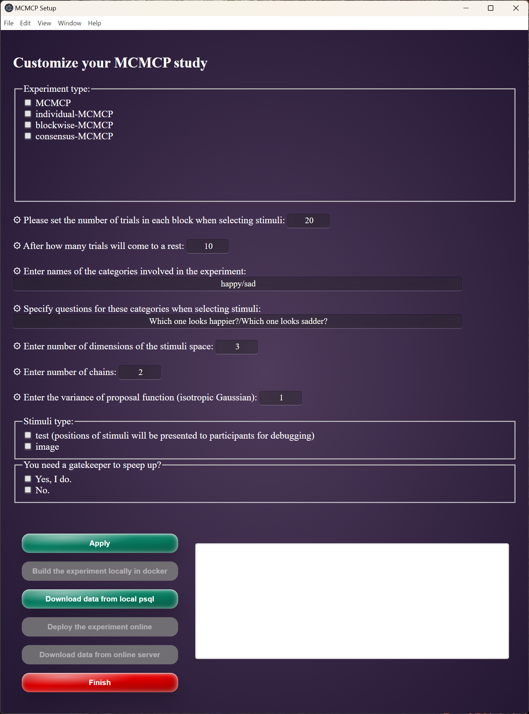
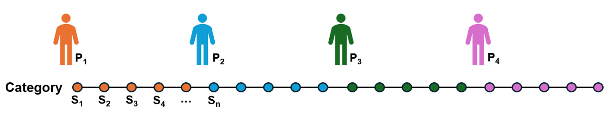
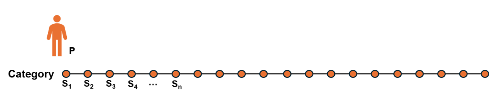
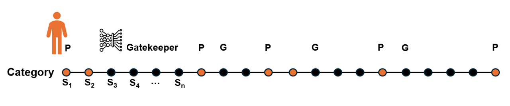
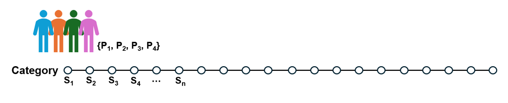
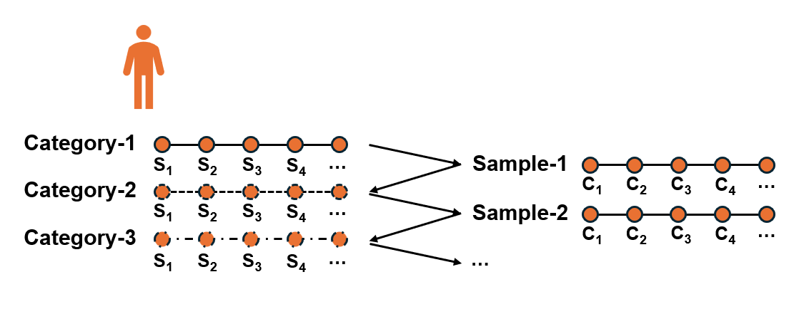

# All-in-One MCMCP (AIOM)

AIOM is an integrated application mainly built by Nodejs for customizing and deploying a Markov Chain Monte Carlo with People (MCMCP) experiment.

## Description

**What is MCMCP?** 
- Markov Chain Monte Carlo with People (MCMCP) is a method for uncovering mental representations that exploits an equivalence between a model of human choice behavior and an element of an MCMC algorithm. The MCMCP method allows for the direct sampling from people/individuals' mental representations of a category or any other symbolic concepts, namely $p(x|c)$, $x$-samples, $c$-category. To illustrate, [which of a set of faces represents the emotion of happiness, or sadness, particularly at the individual level](https://doi.org/10.31234/osf.io/5hm49). Beyond this, MCMCP is generally a versatile add-on for a wide range of studies on human cognition where information of $p(x|c)$ is needed (e.g., categorization and concept learning).

**Why build AIOM?** 
- Customizing and deploying a MCMCP experiment can be really annoying! Previously, we use tools like JSpsych or Dallinger to code up a MCMCP, which either be intrinsically unsuitable for the inter-linked trials and data of MCMCP or takes a very long learning curve for people without prior experiences in Web development. To solve the problem, All-in-One MCMCP application was built for general, coding-friendly use. By using AIOM, researchers are able to design and deploy a local or online MCMCP experiment with just a few clicks on GUI. Moreover, AIOM is open-sourced, which supports thorough customization for users with advanced programming skills and very specific need. Otherwise for most users, the basic functions within the GUI should be enough.

## Getting Started

### Dependencies

* Docker (together with Docker-compose by default). [official release](https://docs.docker.com/get-started/get-docker/)
* Node.js >= v18.16.0 [official release](https://nodejs.org/en/download/prebuilt-installer)

```
// Confirm installation in terminal (MacOS/Linux) or powershell (Windows)

docker -v 
node -v
// should output the version of your installations
```

### How to use AIOM

* Clone this project into a local directory
```
git clone https://github.com/HaijiangYan/AIOM.git
```
* Start Docker Desktop
* Launch the GUI
```{bash}
// In terminal or powershell
// set as working directory
cd AIOM

// launch the GUI
npx electron GUI-main.js
```


* Experiment type: 
    * **MCMCP**: chaining across people to recover mental representations on group level. [Sanborn et la., 2010](https://doi.org/10.1016/j.cogpsych.2009.07.001)
    
    * **individual-MCMCP**: recovering mental representations for an individual (Gatekeepers should be used here to speed up the sampling, as shown in the second figure). [Yan et al., 2024](https://doi.org/10.31234/osf.io/5hm49)
    
    
    * **consensus-MCMCP**: each sample in a chain is accepted by a team, aiming to recovering joint mental representations of multi-individual.
    
    * **blockwise-MCMCP**: applying a Gibbs-sampling framework out of individual-MCMCP to recover both category representations and priors over the involved categories.
    {width=80%}

* General settings:
    * **Number of trials**: how many trials will an individual participant go through for a single category. 
    * **Rest interval**: after how many trials will come to a rest. 
    * **Categories**: enter the categories seperated by slash (no space).
    * **Questions**: specify the questions for each category above, seperated by slash (no space).
    * **Dimensionality**: number of dimensionalities of your parameterized stimuli space.
    * **Number of chains**: how many chains you wish to run in parallel. (In consensus-MCMCP, the **Number of trials** should be integer mutiple of the **Number of chains**)
    * **Proposal function**: as we set the proposal function of Markov Chains as isotropic Gaussian, here you just need to input a single value to indicate the extent of the proposal.
    * **Stimuli type**: test (debug mode) or image (you need to deploy an image generation model on an endpoint in advance).
    * **Gatekeeper**: Yes or No, means whether you need a Gatekeeper to speed up the sampling. Only work for the experiment type *individual-MCMCP* and *blockwise-MCMCP*. If yes, you will need to specify the distributions of Gatekeepers used for each category.

    As such, the total number of trials for each participant should be **Number of trials** $\times$ number of **Categories**, and the number of trials on each chain that are processed by an individual is **Number of trials** $\div$ **Number of chains**.

* Specific settings:
     * **Name of table** for *MCMCP*: set a name for the chain that chains across participants (for other individual-level MCMCP, names are participants' ID by default).
     * **Team size** for *consensus-MCMCP*: how many participants you need in a team to reach a consensus in each trial.
     * **Number of blocks** for *blockwise-MCMCP*: a block contains trials for the "category-1" and "sample-1" in the figure shown above.
     * **Number of trials when selecting categories** for *blockwise-MCMCP*: set the number of trials in each block for selecting categories. For comparison, **Number of trials** in general settings for *blockwise-MCMCP* means the number of trials in each block for selecting samples. Therefore, in each block of *blockwise-MCMCP*, the total number of trials an individual participant will go through should be **Number of trials** $+$ **Number of trials when selecting categories**

* Task control
    * <button>Apply</button>: update the MCMCP with new parameters; <br>
    * <button>Finish</button>: close this control panel; <br>
    **Local mode**
    * <button>Build locally</button>: build the MCMCP container on your local docker for testing and debugging (turn on docker first);
    * <button>Local download</button>: download experiment data from the local postgresql container;<br>
    **Online mode**
    * <button>Deploy online</button>: build the MCMCP container on your remote server;
    * <button>Online download</button>: build the MCMCP container on your remote server; 


## Authors

Haijiang Yan  haijiang.r.yan@gmail.com


## Version History

* 0.1
    * Initial Release (only for local deployment)

## License

This project is licensed under the 

## Acknowledgments

Thanks for great discussion and suggestions from...
