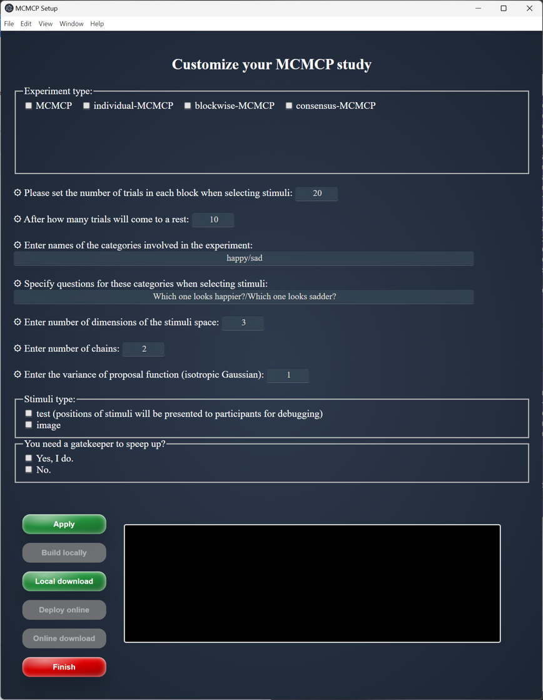

# All-in-One MCMCP (AIOM)

AIOM is an integrated NodeJS application for customizing and deploying a Markov Chain Monte Carlo with People (MCMCP).

## Description

MCMCP: Recover people's mental representations of categories from their decisions.
Customize and deploy a MCMCP to collect data can be really annoying.

## Getting Started

### Dependencies

* Docker (together with Docker-compose by default). [official release](https://docs.docker.com/get-started/get-docker/)
* Node.js >= v18.16.0 [official release](https://nodejs.org/en/download/prebuilt-installer)

### How to use AIOM

* Clone this project into a local directory
```
git clone https://github.com/HaijiangYan/AIOM.git
```
* Launch the GUI
```{bash}
# in terminal
# set as working directory
cd AIOM

# launch the GUI
npx electron GUI-main.js
```


* Setting the parameters to customize your MCMCP
    * Experiment type: 
    * Stimuli type:
    * Gatekeeper:
    * ...
* Task control
    * <button>Apply</button>: update the environment with new parameters; <br>
    <mark>**Local mode**</mark>
    * <button>Build locally</button>: build the MCMCP container on your local docker for testing and debugging (turn on docker first);
    * <button>Local download</button>: download experiment data from the local postgresql container;<br>
    <mark>**Online mode**</mark>
    * <button>Deploy online</button>: build the MCMCP container on your remote server;
    * <button>Online download</button>: build the MCMCP container on your remote server; 
    <br>
    * <button>Finish</button>: close this control panel. 
```
code blocks for commands
```

## Help

Any advise for common problems or issues.
```
command to run if program contains helper info
```

## Authors

Haijiang Yan  haijiang.r.yan@gmail.com


## Version History

* 0.2
    * Various bug fixes and optimizations
    * See [commit change]() or See [release history]()
* 0.1
    * Initial Release

## License

This project is licensed under the [NAME HERE] License - see the LICENSE.md file for details

## Acknowledgments

Thanks for great discussion and suggestions from...
